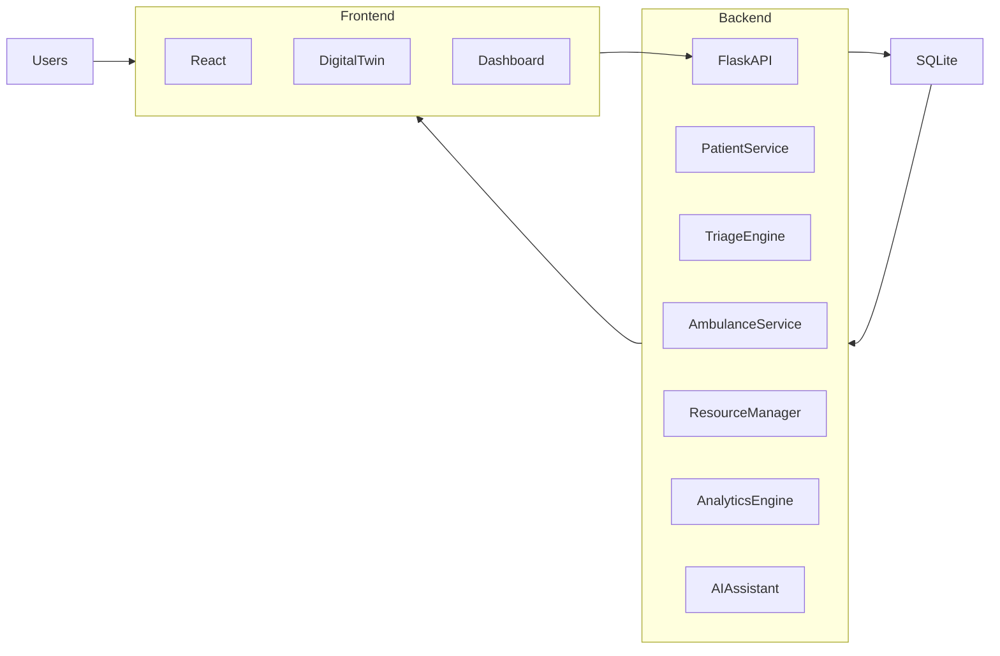
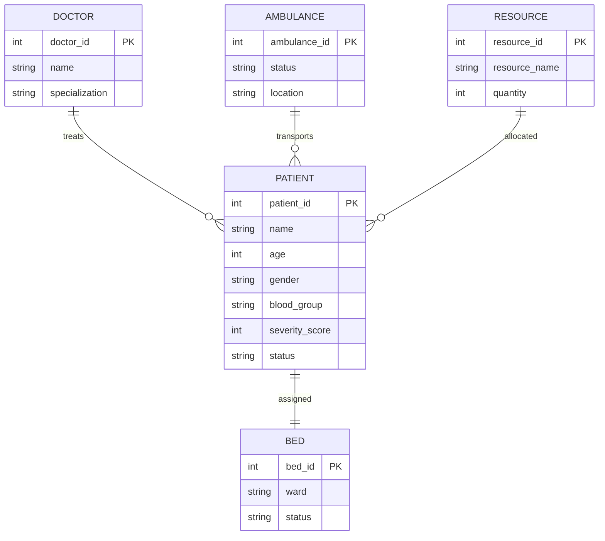
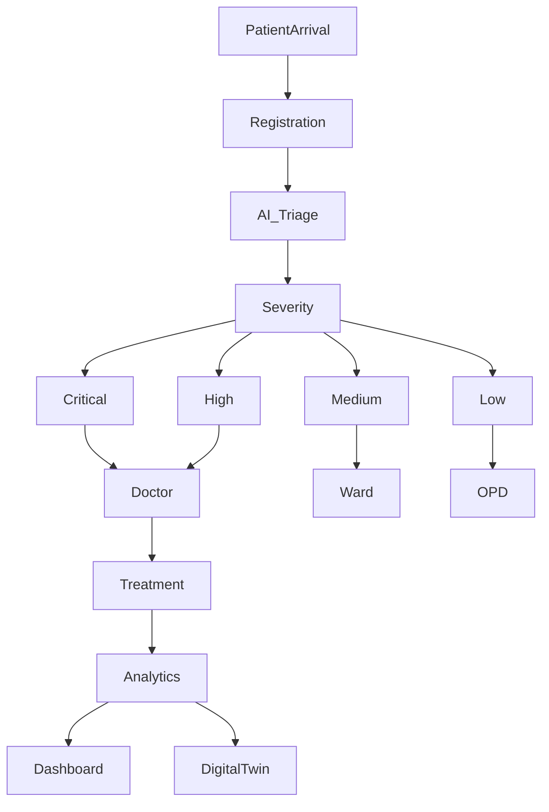
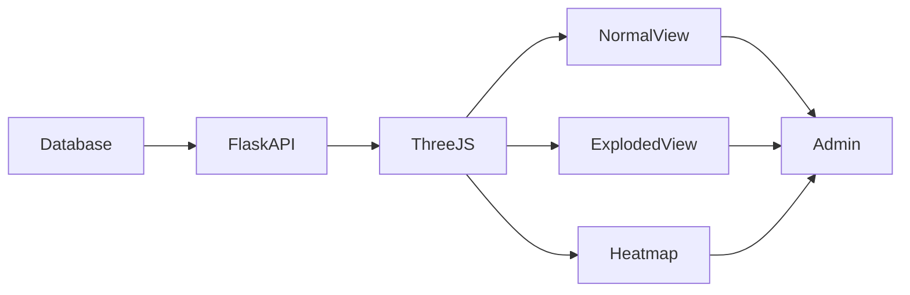

# 🏥 Pulse Matrix

> **AI-Powered Smart Hospital Emergency Management System with Digital Twin Technology**

<p align="center">


</p>

---

# 📖 Overview

Pulse Matrix is a modern **Smart Hospital Emergency Management System** designed to improve emergency healthcare operations using Artificial Intelligence, real-time analytics, and an interactive 3D Digital Twin.

The platform centralizes patient management, emergency triage, ambulance coordination, hospital resource monitoring, and operational analytics into a single intelligent dashboard.

Unlike traditional hospital management systems, Pulse Matrix provides administrators with live situational awareness through a digital representation of the hospital, enabling faster decision-making and more efficient resource allocation.

---

# 🎯 Objectives

- Improve emergency response time
- Reduce ER overcrowding
- Optimize hospital resource allocation
- Enhance patient prioritization using AI
- Provide live hospital monitoring
- Improve ambulance coordination
- Enable data-driven healthcare decisions

---

# 🚨 Problems Solved

### 🚑 Emergency Room Overcrowding

Automatically prioritizes incoming patients using an intelligent severity scoring engine.

---

### 🏥 Lack of Real-Time Hospital Visibility

Provides administrators with a real-time Digital Twin to monitor hospital operations visually.

---

### 🚑 Ambulance Coordination

Tracks ambulances, dispatches emergency teams, and estimates arrival times.

---

### 📊 Resource Fragmentation

Centralizes monitoring of:

- Beds
- ICU
- Doctors
- Nurses
- Oxygen
- Ventilators
- Emergency Equipment

---

# ✨ Key Features

## 👨‍⚕️ Patient Management

- Patient Registration
- Patient Timeline
- Medical Records
- Lab Reports
- Imaging Reports
- Prescriptions
- Admission History

---

## 🚑 Emergency Triage

- AI Severity Score
- Critical Patient Detection
- Smart Emergency Queue
- Automatic Priority Assignment

---

## 🏥 Hospital Dashboard

- Hospital Overview
- Bed Occupancy
- Emergency Queue
- Live Statistics
- Critical Alerts

---

## 👨‍⚕️ Doctor Dashboard

- Assigned Patients
- Daily Schedule
- Notifications
- Clinical Notes
- Patient History

---

## 🚑 Ambulance Command Center

- Live Ambulance Tracking
- GPS Monitoring
- ETA Prediction
- Dispatch Management
- Priority Routing

---

## 🤖 AI Clinical Assistant

- AI Patient Summary
- AI Clinical Notes
- Risk Assessment
- Intelligent Recommendations
- Handover Reports

---

## 📊 Analytics Dashboard

- Bed Occupancy
- Patient Trends
- Resource Usage
- Emergency Statistics
- Department Performance

---

# 🌐 Digital Twin Command Center

One of the flagship features of Pulse Matrix is the interactive **3D Digital Twin** built using **Three.js** and **React Three Fiber**.

### Features

- Normal Building View
- Exploded Floor View
- Heatmap Visualization
- Interactive Hospital Nodes
- Live Resource Status
- Department Monitoring
- Patient Density Analysis

Administrators can click any room, department, or bed to access real-time operational information.

---

# 🏗️ System Architecture



---

# 🗄️ Database ER Diagram



---

# 🚀 Application Workflow



---

# 🌍 Digital Twin Architecture



---

# 💻 Technology Stack

## Frontend

- React
- Vite
- Tailwind CSS
- Framer Motion
- React Router
- Three.js
- React Three Fiber

## Backend

- Python
- Flask
- REST APIs

## Database

- SQLite

## AI & Algorithms

- AI Clinical Assistant
- Severity Prediction Engine
- Smart Triage Algorithm
- Risk Assessment

---

# 📂 Project Structure

```
Pulse_Matrix/

│

├── backend/

│ ├── app.py

│ ├── routes/

│ ├── services/

│ ├── database/

│ └── ai/

│

├── frontend/

│ ├── src/

│ ├── components/

│ ├── pages/

│ ├── dashboard/

│ ├── digitalTwin/

│ ├── assets/

│ └── App.jsx

│

├── public/

├── package.json

└── README.md
```

---

# 🚀 Installation

## Clone Repository

```bash
git clone https://github.com/YOUR_USERNAME/Pulse_Matrix.git

cd Pulse_Matrix
```

---

## Install Frontend

```bash
npm install

npm run dev
```

---

## Install Backend

```bash
cd backend

pip install -r requirements.txt

python app.py
```

---

# 📸 Screenshots

> Replace the placeholders below with your screenshots.

## 🏠 Dashboard

<!-- Add Dashboard Screenshot Here -->

```
Example:

assets/screenshots/dashboard.png
```

---

## 🌐 Digital Twin

<!-- Add Digital Twin Screenshot Here -->

```
Example:

assets/screenshots/digital-twin.png
```

---

## 🚑 Ambulance Dashboard

<!-- Add Ambulance Screenshot Here -->

```
Example:

assets/screenshots/ambulance.png
```

---

## 👨‍⚕️ Patient Management

<!-- Add Patient Management Screenshot Here -->

```
Example:

assets/screenshots/patient.png
```

---

## 📊 Analytics Dashboard

<!-- Add Analytics Screenshot Here -->

```
Example:

assets/screenshots/analytics.png
```

---

## 🤖 AI Assistant

<!-- Add AI Screenshot Here -->

```
Example:

assets/screenshots/ai-assistant.png
```

---

# 🔮 Future Enhancements

- [x] Smart Patient Management
- [x] AI Emergency Triage
- [x] Digital Twin
- [x] Ambulance Tracking
- [x] Hospital Analytics
- [ ] IoT Medical Devices
- [ ] Wearable Health Integration
- [ ] AI Disease Prediction
- [ ] Cloud Deployment
- [ ] Mobile Application
- [ ] Multi-Hospital Network
- [ ] Voice Assistant

---

# 👥 Contributors

| Name | Role |
|------|------|
| **Adharv S Ravi** | Frontend Developer |
| **Adithya NC** | Backend Developer |

---

# 🤝 Contributing

Contributions are welcome!

1. Fork the repository
2. Create a feature branch

```bash
git checkout -b feature-name
```

3. Commit your changes

```bash
git commit -m "Added new feature"
```

4. Push to GitHub

```bash
git push origin feature-name
```

5. Open a Pull Request

---

# 📄 License

This project is licensed under the **MIT License**.

---

# 💙 Acknowledgements

Special thanks to everyone who contributed to the development of Pulse Matrix and supported the vision of building smarter, AI-driven healthcare solutions.

---

# ⭐ Show Your Support

If you found this project useful:

⭐ Star this repository

🍴 Fork the project

💬 Share your feedback

🚀 Contribute to its development

---

<p align="center">

**Built with ❤️ using React, Flask, AI, and Digital Twin Technology to transform emergency healthcare management.**

</p>
